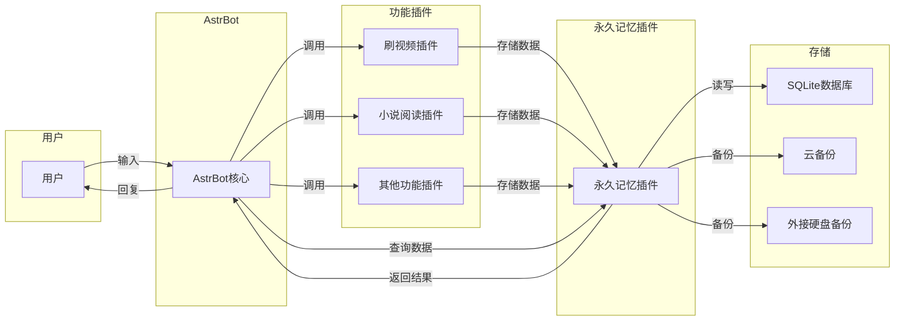
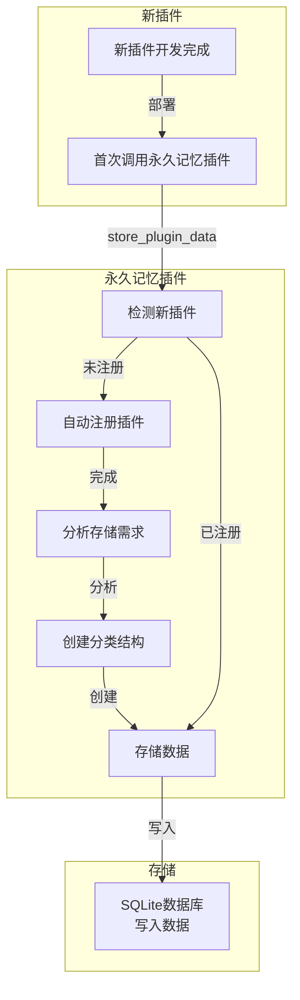

# AstrBot 永久记忆系统工作流程图

## 一、数据存储流程

```mermaid
flowchart TD
    subgraph 用户层
        A[用户输入\n"帮我刷一下这个B站视频"]
        Z[用户接收\n"已完成并存储观后感"]
    end
    
    subgraph AI层
        B[AI分析请求]
        Y[AI生成回复]
    end
    
    subgraph 插件层
        C[调用功能插件\n刷视频插件]
        D[功能插件处理\n分析视频内容]
        E[生成数据\n视频观后感]
        F[调用永久记忆插件\nstore_plugin_data]
    end
    
    subgraph 存储层
        G[永久记忆插件\n处理存储请求]
        H[自动创建分类\nbilibili_watcher/video_summary]
        I[写入SQLite数据库]
    end
    
    A -->|消息| B
    B -->|调用| C
    C -->|处理| D
    D -->|生成| E
    E -->|存储| F
    F -->|请求| G
    G -->|创建| H
    H -->|写入| I
    I -->|完成| Y
    Y -->|回复| Z
```

## 二、数据查询流程

```mermaid
flowchart TD
    subgraph 用户层
        A[用户输入\n"你记得那个关于AI的视频吗？"]
        Z[用户接收\n"是的，那个视频主要讲了..."]
    end
    
    subgraph AI层
        B[AI分析请求]
        C[提取关键词\n"AI视频"]
        Y[AI生成回复]
    end
    
    subgraph 插件层
        D[调用永久记忆插件\nquery_relation]
        E[永久记忆插件\n处理查询请求]
    end
    
    subgraph 存储层
        F[SQLite数据库\n模糊搜索]
        G[返回匹配结果]
    end
    
    A -->|消息| B
    B -->|提取| C
    C -->|调用| D
    D -->|请求| E
    E -->|查询| F
    F -->|结果| G
    G -->|返回| Y
    Y -->|回复| Z
```

## 三、多插件协同流程

```mermaid
flowchart TD
    subgraph 用户层
        A[用户输入\n"帮我刷B站和YouTube视频"
"对比两个视频的观点"]
        Z[用户接收\n"两个视频的观点对比：..."]
    end
    
    subgraph AI层
        B[AI分析请求]
        Y[AI生成对比分析]
    end
    
    subgraph 插件层
        C[调用B站刷视频插件]
        D[调用YouTube刷视频插件]
        E[B站插件生成观后感]
        F[YouTube插件生成观后感]
        G[调用永久记忆插件存储]
        H[调用永久记忆插件查询]
    end
    
    subgraph 存储层
        I[SQLite数据库\n存储B站观后感]
        J[SQLite数据库\n存储YouTube观后感]
        K[SQLite数据库\n查询两个视频]
    end
    
    A -->|消息| B
    B -->|调用| C
    B -->|调用| D
    C -->|生成| E
    D -->|生成| F
    E -->|存储| G
    F -->|存储| G
    G -->|写入| I
    G -->|写入| J
    B -->|查询| H
    H -->|请求| K
    K -->|结果| Y
    Y -->|回复| Z
```

## 四、核心组件交互图



## 五、插件注册与存储结构创建流程



## 六、流程图说明

### 6.1 符号说明

- **矩形**：流程步骤
- **圆角矩形**：用户交互
- **菱形**：决策点
- **椭圆**：开始/结束
- **箭头**：流程方向

### 6.2 流程说明

1. **数据存储流程**：展示了从用户请求刷视频到数据存储完成的完整过程
2. **数据查询流程**：展示了用户查询之前存储信息的过程
3. **多插件协同流程**：展示了多个功能插件如何协同使用永久记忆插件
4. **核心组件交互图**：展示了系统各组件之间的关系和数据流向
5. **插件注册流程**：展示了新插件如何自动注册并创建存储结构

### 6.3 关键特性

- **自动化**：功能插件自动调用永久记忆插件存储数据，无需人工干预
- **无侵入**：新插件无需修改永久记忆插件代码，直接调用即可
- **智能分类**：自动创建多层级分类结构，保持数据组织清晰
- **安全可靠**：支持多重备份，确保数据安全

通过以上流程图，可以清晰了解 AstrBot 永久记忆系统的完整工作流程，从用户输入到AI完成任务的全过程。