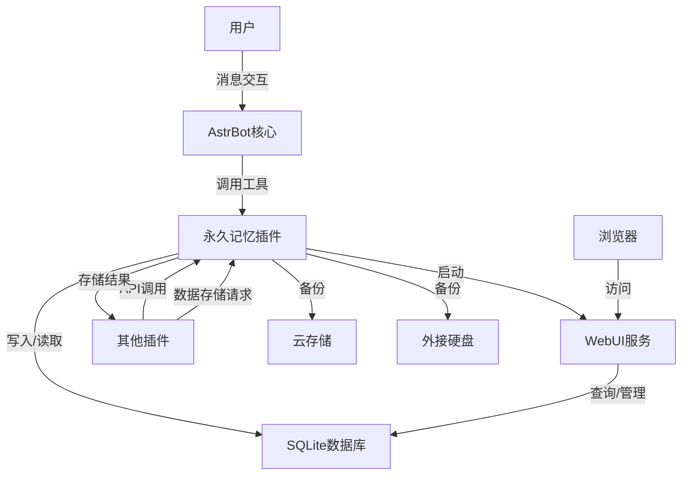

# AstrBot 永久记忆系统插件项目计划书

## 一、项目概述

### 1.1 项目背景

在当前的AI交互中，记忆能力是提升用户体验的关键因素。用户希望AI能够记住之前的对话内容、个人偏好以及关系互动，从而提供更加个性化和连贯的服务。AstrBot作为一个智能聊天机器人，需要一个永久记忆系统来存储和管理这些信息。

### 1.2 项目目标

开发一个轻量级、高效的永久记忆系统插件，实现以下核心功能：
- **笔记本功能**：记录和管理关于事物的信息
- **关系网功能**：记录和管理关于人物的关系和印象
- **智能查询**：支持通过名字、特征等方式模糊查询
- **WebUI管理**：提供可视化界面查看和管理记忆数据

### 1.3 项目价值

- 提升用户体验：AI能够记住用户的偏好和历史互动
- 增强个性化服务：基于记忆数据提供更符合用户需求的响应
- 建立长期关系：通过持续的记忆积累，AI与用户的关系会越来越紧密
- 可扩展性强：模块化设计便于后续功能扩展

## 二、技术架构

### 2.1 技术栈

| 类别 | 技术/工具 | 版本 | 用途 |
|------|----------|------|------|
| 开发语言 | Python | 3.8+ | 插件核心逻辑开发 |
| 数据库 | SQLite | 内置 | 轻量级本地数据存储 |
| Web框架 | Flask | 2.0+ | WebUI后端服务 |
| 前端框架 | Bootstrap | 5.0+ | WebUI界面展示 |
| 配置管理 | YAML | - | 插件配置文件 |
| 云存储集成 | 网盘API | - | 数据备份和云存储 |
| 外部存储 | 本地文件系统 | - | 外接硬盘备份 |

### 2.2 系统架构



### 2.3 核心技术点

1. **Upsert操作**：实现数据的智能增改，无需AI判断操作类型
2. **印象融合算法**：基于证据的渐进式更新，保留旧信息的同时融入新信息
3. **模糊匹配查询**：支持通过名字、特征等方式查询关系
4. **虚拟文件夹系统**：基于分类和时间的层级结构，无需实际创建文件夹
5. **异步Web服务**：在独立线程中运行Flask应用，不影响主程序

## 三、功能模块设计

### 3.0 插件间通信机制

#### 3.0.1 跨插件数据存储接口

为了支持其他插件（如B站刷视频插件、小说阅读插件等）的数据存储需求，永久记忆插件需要提供标准化的跨插件接口，实现**零代码修改**的扩展性：

- **自动插件注册**：
  - 其他插件无需修改永久记忆插件代码，通过配置文件或API自动注册
  - 首次调用时自动检测并注册新插件
  - 支持热插拔，即插即用

- **智能动态存储结构**：
  - 完全自动创建多层级分类结构，无需手动配置
  - 支持任意深度的分类层级，适应复杂存储需求
  - 基于插件名称和数据类型自动生成分类路径

- **通用数据写入接口**：
  ```python
  def store_plugin_data(plugin_name, data_type, content, metadata=None, categories=None):
      """存储插件数据（零配置自动适应）
      plugin_name: 插件名称（如"bilibili_watcher"、"novel_reader"）
      data_type: 数据类型（如"video_summary"、"chapter_notes"）
      content: 数据内容
      metadata: 附加元数据（如视频ID、小说章节等）
      categories: 自定义分类路径（可选，如["2024", "10月", "科技"]）
      """
      # 自动检测并注册新插件
      # 智能生成或使用自定义分类路径
      # 写入数据到对应分类
      # 返回存储结果
  ```

- **无侵入设计**：
  - 永久记忆插件核心代码一次编写，终身使用
  - 新插件无需了解内部实现，只需调用统一API
  - 支持无限扩展，适应未来任意数量和类型的插件

#### 3.0.2 数据分类策略

- **动态多层级分类结构**：
  - **自动层级生成**：根据插件提供的信息自动创建任意深度的分类层级
  - **灵活分类路径**：支持插件自定义完整分类路径，如["平台", "内容类型", "年份", "月份"]
  - **智能默认分类**：当插件未指定分类时，自动按["插件名称", "数据类型", "年份", "月份"]生成

- **无配置自适应**：
  - **零配置启动**：新插件首次调用时自动完成注册和分类结构创建
  - **运行时调整**：支持插件在运行时动态调整分类策略
  - **向后兼容**：旧插件数据结构保持不变，新插件自动使用新分类体系

- **分类管理功能**：
  - **自动清理**：定期清理空分类，保持结构整洁
  - **分类合并**：支持相似分类的智能合并
  - **分类重命名**：允许插件申请重命名分类

### 3.1 笔记本模块

| 功能点 | 描述 | 实现方式 |
|--------|------|----------|
| 写入笔记 | AI将信息记录到笔记本中 | 调用write_note工具，支持自定义分类 |
| 读取笔记 | AI查询笔记本中的信息 | 调用query_note工具，支持关键词搜索 |
| 笔记分类 | 自动创建和管理笔记分类 | 基于category字段，支持AI自动分类 |
| 时间归档 | 按时间维度组织笔记 | 基于created_at字段，支持年月日记档 |

### 3.2 关系网模块

| 功能点 | 描述 | 实现方式 |
|--------|------|----------|
| 关系记录 | 记录用户与他人的关系 | 调用update_relation工具，支持好感度、标签、备注 |
| 印象管理 | 维护和更新人物印象 | 基于impression_summary字段，实现渐进式更新 |
| 模糊查询 | 通过名字、特征查询关系 | 调用query_relation工具，支持LIKE模糊搜索 |
| 昵称历史 | 记录用户的昵称变化 | 基于alias_history字段，支持历史昵称查询 |

### 3.3 WebUI模块

| 功能点 | 描述 | 实现方式 |
|--------|------|----------|
| 数据展示 | 展示笔记本和关系网数据 | Flask API + Bootstrap表格 |
| 层级导航 | 按分类和时间浏览笔记 | 树形结构导航栏 |
| 数据管理 | 编辑、删除记忆数据 | Web界面操作，直接更新数据库 |
| 配置管理 | 管理插件配置参数 | 热重载config.yaml文件 |

## 四、开发计划

### 4.1 开发阶段

| 阶段 | 时间 | 任务 | 交付物 |
|------|------|------|--------|
| 阶段一：基础架构 | 1-2天 | 搭建插件骨架、数据库初始化、笔记本基础功能 | 插件目录结构、数据库表结构、笔记写入/读取功能 |
| 阶段二：核心功能 | 2-3天 | 实现关系网功能、印象融合算法、模糊匹配查询 | 关系管理工具、印象更新逻辑、智能查询功能 |
| 阶段三：WebUI开发 | 1-2天 | 搭建Flask服务、开发Web界面、实现数据管理功能 | WebUI界面、数据管理API、配置热重载 |
| 阶段四：测试优化 | 1天 | 功能测试、性能优化、文档完善 | 测试报告、优化方案、使用文档 |

### 4.2 关键里程碑

1. **笔记本功能完成**：AI能够成功写入和读取笔记
2. **关系网功能完成**：AI能够记录和更新人物关系
3. **WebUI上线**：用户能够通过浏览器查看和管理记忆数据
4. **插件发布**：完成所有功能开发和测试，正式发布

### 4.3 开发优先级

1. **高优先级**：笔记本基础功能、关系记录功能
2. **中优先级**：印象融合算法、WebUI基础功能
3. **低优先级**：高级查询功能、配置热重载

## 五、项目结构

```text
AstrBotPlugin_PermanentMemory/
├── main.py                 # 插件入口，注册工具，监听消息
├── config.yaml             # 配置文件 (API Key, 开关, WebUI端口)
├── databases/
│   ├── __init__.py
│   ├── db_manager.py       # 数据库核心操作类
│   ├── models.py           # 数据结构定义
├── tools/
│   ├── __init__.py
│   ├── tool_notebook.py    # 笔记本工具逻辑
│   └── tool_relation.py    # 关系网工具逻辑
├── webui/
│   ├── server.py           # Flask后端接口
│   ├── templates/          # HTML模板
│   └── static/             # CSS/JS
├── data/
│   └── memory.db           # SQLite数据库文件 (自动生成)
└── README.md               # 使用文档
```

## 六、功能实现细节

### 6.0 存储容量分析

### 6.0.3 AI自动存储机制

#### 6.0.3.1 刷视频插件与永久记忆的集成流程

当AI刷B站视频并生成观后感时，存储流程如下：

1. **AI触发刷视频**：用户请求AI刷B站视频
2. **调用刷视频插件**：AI调用刷视频插件的接口
3. **生成观后感**：刷视频插件完成视频分析并生成观后感
4. **自动存储到永久记忆**：刷视频插件调用永久记忆插件的存储接口
5. **AI确认存储**：AI向用户确认视频已刷完并存储了观后感

#### 6.0.3.2 实现方式

- **插件间直接调用**：刷视频插件在生成观后感后，直接调用永久记忆插件的存储接口
  ```python
  # 刷视频插件代码示例
  def process_video(video_url):
      # 处理视频，生成观后感
      summary = generate_summary(video_url)
      
      # 直接存储到永久记忆（无需AI额外操作）
      from astrbot_plugin_memory_capsule import store_plugin_data
      store_plugin_data(
          plugin_name="bilibili_watcher",
          data_type="video_summary",
          content=summary,
          metadata={"video_url": video_url, "timestamp": get_current_time()}
      )
      
      return "已完成视频处理并存储观后感"
  ```

- **AI提示词引导**：在AI的系统提示词中添加引导，确保AI知道如何处理生成的内容
  ```
  # 系统提示词示例
  你可以调用刷视频插件来处理B站视频。当刷视频插件完成处理后，它会自动将观后感存储到永久记忆系统中。你需要向用户确认视频已处理完成，并告知用户观后感已存储。
  ```

#### 6.0.3.3 提示词设计建议

- **放置位置**：建议在AI的系统提示词（System Prompt）中添加相关引导
- **提示词内容**：
  1. 明确告知AI可以调用哪些插件
  2. 说明插件调用的预期结果
  3. 指导AI如何向用户反馈结果
  4. 无需特别提示存储操作，因为插件会自动处理

- **示例提示词**：
  ```
  你是一个智能助手，拥有以下能力：
  1. 可以调用刷视频插件来观看和分析B站视频
  2. 刷视频插件会自动生成观后感并存储到永久记忆系统
  3. 当你调用刷视频插件后，需要向用户确认任务完成
  4. 用户可以随时查询存储在永久记忆中的内容
  
  当用户要求你刷B站视频时，请直接调用刷视频插件处理，并在完成后告知用户观后感已存储。
  ```

#### 6.0.3.4 优势

- **自动化流程**：整个过程无需用户干预，AI和插件自动完成
- **无感知存储**：用户只需要请求刷视频，不需要关心存储过程
- **统一管理**：所有观后感集中存储在永久记忆系统中，便于后续查询
- **可扩展性**：同样的机制适用于其他插件，如小说阅读、图片分析等

#### 6.0.1 SQLite存储需求评估

- **文本数据存储效率**：SQLite对文本数据存储非常高效，1MB空间可存储约100-150万个字符
- **单条记录大小**：
  - 笔记：200-500字的观后感约占1-2KB
  - 关系记录：每条约0.5-1KB
- **存储空间估算**：
  - 1000条笔记：约1-2MB
  - 1000条关系记录：约0.5-1MB
  - 总计：即使存储10,000条记录，也仅需约10-20MB空间
- **结论**：对于以文本为主的记忆存储，SQLite完全满足需求，不会对50GB服务器空间造成压力

#### 6.0.2 备份方案

##### 6.0.2.1 本地备份

- **自动备份脚本**：
  ```python
  # backup_script.py
  import shutil
  import datetime
  import os
  
  def backup_database():
      # 源数据库路径
      src_db = "data/memory.db"
      # 备份路径（可配置为外接硬盘挂载点）
      backup_dir = "D:/backup/astrbot/"
      os.makedirs(backup_dir, exist_ok=True)
      
      # 生成带时间戳的备份文件名
      timestamp = datetime.datetime.now().strftime("%Y%m%d_%H%M%S")
      backup_file = f"{backup_dir}memory_{timestamp}.db"
      
      # 执行备份
      shutil.copy2(src_db, backup_file)
      print(f"备份完成：{backup_file}")
  
  if __name__ == "__main__":
      backup_database()
  ```
- **定时执行**：使用系统任务计划程序（Windows）或cron（Linux）定期执行

##### 6.0.2.2 云存储备份

- **网盘API集成**：
  - 支持百度网盘、阿里云盘、夸克云盘等主流网盘
  - 使用第三方Python库或官方API，夸克云盘可通过其开放平台API实现
- **实现方案**：
  ```python
  # cloud_backup.py
  def upload_to_cloud(local_file, cloud_path):
      # 初始化网盘客户端
      # 上传文件
      # 返回上传结果
  ```
- **优势**：
  - 数据安全，不怕本地硬件故障
  - 可设置自动同步，无需手动操作
  - 支持多设备访问

##### 6.0.2.3 外接硬盘备份

- **自动检测与备份**：
  - 检测外接硬盘挂载状态
  - 当检测到指定硬盘时自动执行备份
- **实现方案**：
  ```python
  # external_backup.py
  def check_external_drive():
      # 检测外接硬盘是否存在
      # 存在则执行备份
  ```
- **优势**：
  - 存储容量大，适合长期归档
  - 数据完全掌控在本地
  - 成本相对较低

##### 6.0.2.4 备份策略建议

- **混合备份策略**：
  1. **每日本地备份**：确保数据安全性
  2. **每周云存储备份**：防止本地灾难
  3. **每月外接硬盘备份**：长期归档
- **备份验证**：定期验证备份文件的完整性
- **备份清理**：自动清理过期备份，节省存储空间

### 6.1 笔记本功能

#### 6.1.1 数据结构

| 字段名 | 类型 | 描述 |
|--------|------|------|
| id | INTEGER | 主键，自增 |
| category | TEXT | 笔记分类/文件夹 |
| title | TEXT | 笔记标题 |
| content | TEXT | 笔记内容 |
| tags | TEXT | 标签 |
| created_at | TIMESTAMP | 创建时间 |
| updated_at | TIMESTAMP | 更新时间 |

#### 6.1.2 核心操作

```python
def write_note(content, category="default", title=None, tags=None):
    """写入笔记"""
    # 自动生成标题（如果未提供）
    # 插入数据库
    # 返回操作结果

def query_note(keyword=None, category=None, start_date=None, end_date=None):
    """查询笔记"""
    # 构建SQL查询
    # 执行查询
    # 返回结果
```

### 6.2 关系网功能

#### 6.2.1 数据结构

| 字段名 | 类型 | 描述 |
|--------|------|------|
| id | INTEGER | 主键，自增 |
| user_id | TEXT | 用户ID |
| group_id | TEXT | 群组ID |
| nickname | TEXT | 昵称 |
| alias_history | TEXT | 昵称历史 |
| impression_summary | TEXT | 印象总结 |
| favor_level | INTEGER | 好感度(0-100) |
| interaction_count | INTEGER | 互动次数 |
| last_interaction_time | TIMESTAMP | 最后互动时间 |
| created_at | TIMESTAMP | 创建时间 |

#### 6.2.2 核心操作

```python
def update_relation(user_id, group_id, nickname=None, favor_change=0, impression=None, note=None):
    """更新关系"""
    # 检查是否存在记录
    # 存在则更新，不存在则创建
    # 处理好感度变化
    # 融合印象
    # 返回操作结果

def query_relation(query_keyword):
    """查询关系"""
    # 模糊搜索昵称、历史昵称、印象
    # 处理搜索结果
    # 返回匹配结果
```

### 6.3 WebUI功能

#### 6.3.1 API接口

| 接口路径 | 方法 | 功能 |
|----------|------|------|
| /api/notes | GET | 获取笔记列表 |
| /api/notes | POST | 创建新笔记 |
| /api/notes/{id} | GET | 获取笔记详情 |
| /api/notes/{id} | PUT | 更新笔记 |
| /api/notes/{id} | DELETE | 删除笔记 |
| /api/relations | GET | 获取关系列表 |
| /api/relations/{id} | GET | 获取关系详情 |
| /api/relations/{id} | PUT | 更新关系 |
| /api/relations/{id} | DELETE | 删除关系 |

#### 6.3.2 界面设计

- **左侧导航栏**：树形结构展示分类和时间归档
- **右侧内容区**：表格展示数据列表，点击查看详情
- **操作按钮**：添加、编辑、删除功能
- **搜索框**：支持关键词搜索

## 七、优缺点分析

### 7.1 优点

1. **轻量级设计**：使用SQLite内置数据库，无需额外安装
2. **易于集成**：作为AstrBot插件，可直接集成到现有系统
3. **智能交互**：支持模糊匹配和多候选确认，提升用户体验
4. **可扩展性强**：模块化设计便于后续功能扩展
5. **可视化管理**：WebUI界面便于查看和管理记忆数据
6. **渐进式更新**：印象融合算法确保记忆的连续性和准确性

### 7.2 缺点

1. **存储限制**：SQLite本地存储，数据量较大时可能影响性能（但对于文本数据，存储空间需求较小）
2. **搜索能力**：基于LIKE的模糊搜索，复杂查询效率不高
3. **依赖AI判断**：印象更新依赖AI的判断，可能存在误判
4. **WebUI功能简单**：仅提供基础数据管理功能，无高级分析工具
5. **无备份机制**：未实现自动备份功能，数据丢失风险

### 7.3 改进方向

1. **数据存储优化**：考虑引入向量数据库提升搜索能力
2. **自动备份**：实现定期自动备份机制，支持云存储、网盘和外接存储
3. **高级分析**：添加数据统计和分析功能
4. **多端同步**：支持数据多端同步
5. **情绪分析**：引入情绪分析增强印象判断准确性

## 八、可行性评估

### 8.1 技术可行性

- **技术成熟度**：使用的技术栈均为成熟稳定的开源技术
- **开发难度**：中等，核心功能逻辑清晰，实现难度不大
- **资源需求**：低，仅需Python环境和少量依赖库
- **兼容性**：良好，与AstrBot架构兼容

### 8.2 功能可行性

- **需求明确**：功能需求清晰，逻辑关系明确
- **实现路径**：有详细的开发计划和技术方案
- **用户体验**：设计合理，符合用户使用习惯
- **扩展性**：模块化设计便于后续功能扩展

### 8.3 风险评估

| 风险 | 可能性 | 影响 | 缓解措施 |
|------|--------|------|----------|
| 数据库性能问题 | 低 | 中 | 定期清理旧数据，优化查询语句 |
| AI判断错误 | 中 | 低 | 增加人工确认机制，优化印象融合算法 |
| 数据丢失 | 低 | 高 | 实现自动备份功能，提醒用户定期备份 |
| 功能扩展困难 | 低 | 中 | 严格遵循模块化设计，保持接口一致性 |

## 九、投资回报分析

### 9.1 开发成本

| 成本项 | 估算 | 说明 |
|--------|------|------|
| 开发时间 | 7-10天 | 包含设计、开发、测试和文档 |
| 人力成本 | 低 | 单开发者即可完成 |
| 硬件成本 | 无 | 无需额外硬件设备 |
| 软件成本 | 无 | 使用开源免费软件 |

### 9.2 收益预测

- **用户体验提升**：显著提升AstrBot的记忆能力，增强用户粘性
- **功能差异化**：永久记忆功能是AI聊天机器人的重要差异化特性
- **后续扩展价值**：基于记忆系统可开发更多个性化功能
- **社区贡献**：作为开源插件，可获得社区反馈和贡献

### 9.3 投资回报周期

- **短期回报**：开发完成后立即提升用户体验
- **中期回报**：通过用户反馈持续优化，增强功能
- **长期回报**：成为AstrBot的核心竞争力之一

## 十、结论与建议

### 10.1 结论

AstrBot永久记忆系统插件项目技术可行、功能明确、投资回报合理。该项目能够显著提升AstrBot的记忆能力和用户体验，为后续功能扩展奠定基础。

### 10.2 建议

1. **分阶段开发**：按照计划分阶段开发，确保每个阶段的功能质量
2. **注重测试**：在每个阶段完成后进行充分测试，确保功能稳定性
3. **用户反馈**：积极收集用户反馈，持续优化功能
4. **文档完善**：编写详细的使用文档和开发文档
5. **安全考虑**：注意保护用户隐私数据，实现数据加密存储

### 10.3 下一步行动

1. 确认项目计划和技术方案
2. 开始第一阶段开发（基础架构）
3. 定期进行进度检查和调整
4. 开发完成后进行全面测试
5. 发布插件并收集用户反馈

---

**项目状态**：准备阶段
**计划开始日期**：待确认
**预计完成日期**：开始后7-10天

*本计划书将根据实际开发情况进行调整和优化。*